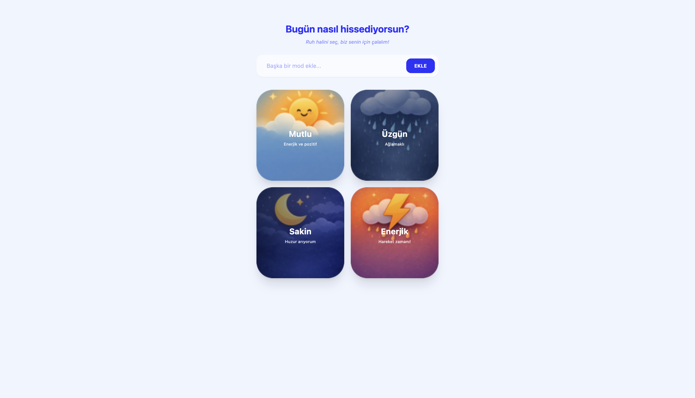
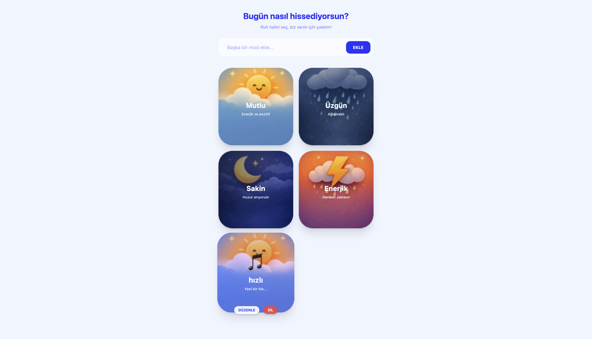
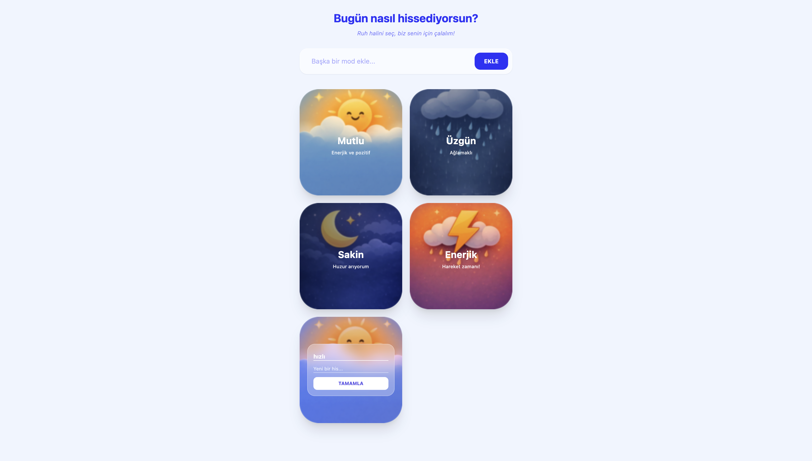
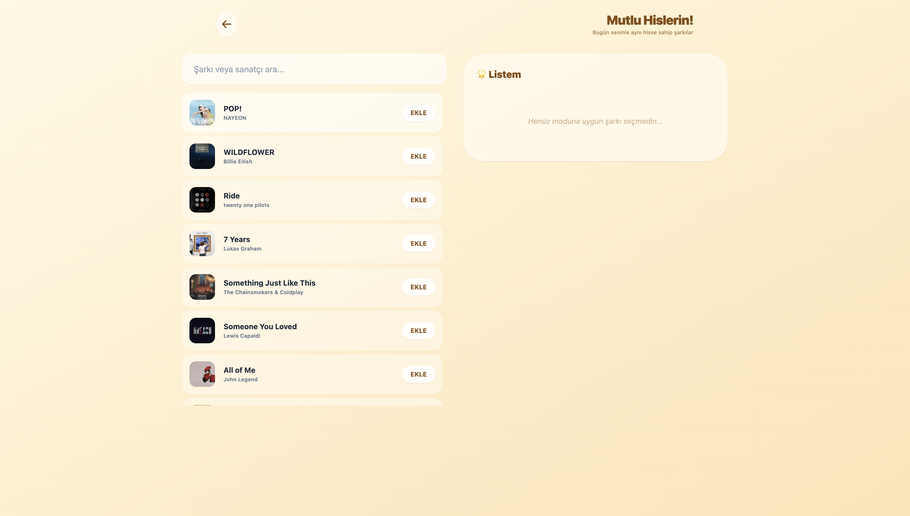
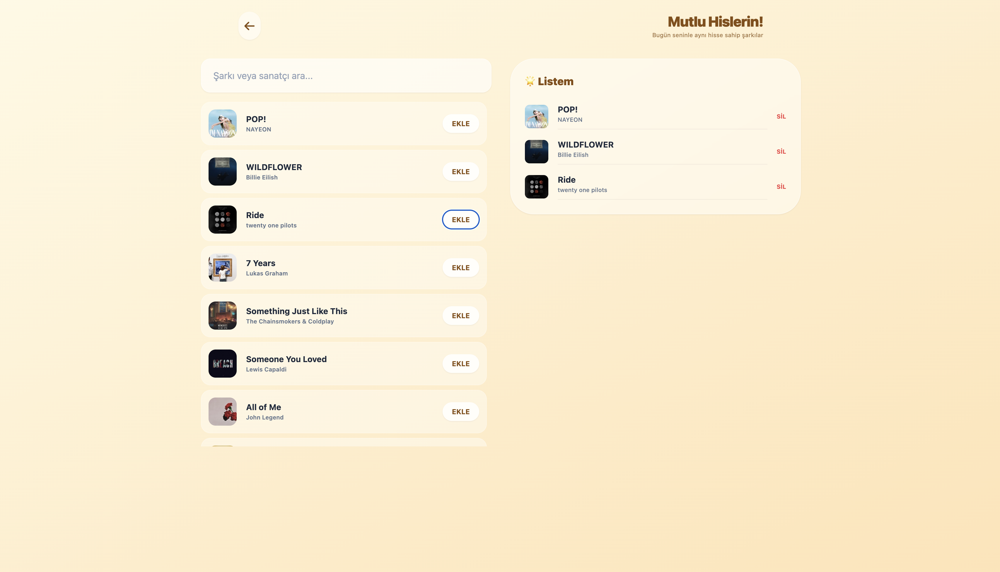
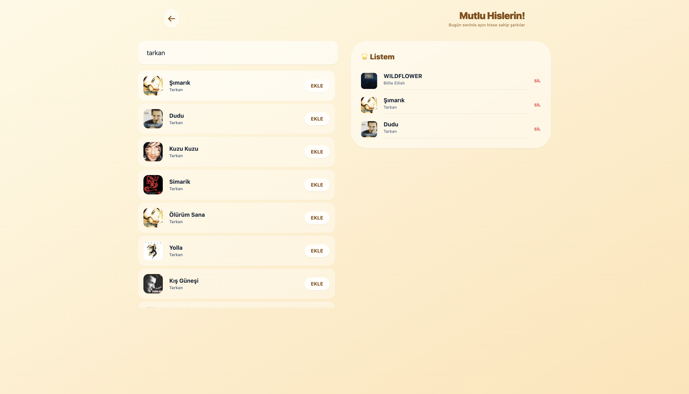
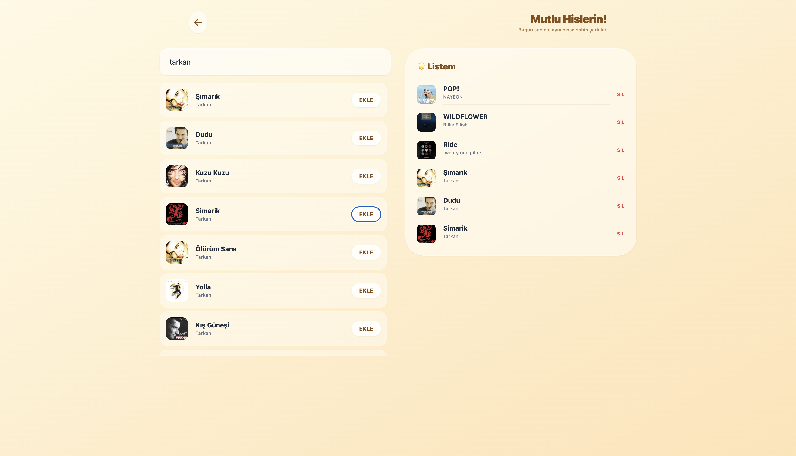
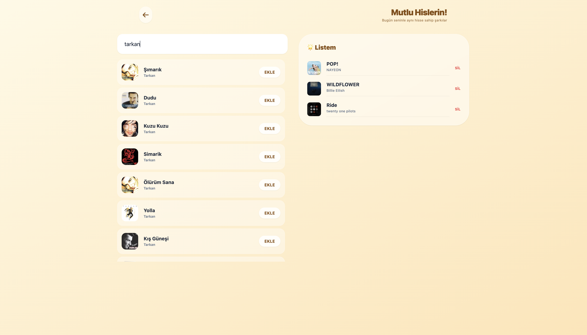

# 🎵 Moodify - Duygu Durumuna Göre Müzik Yönetimi

Bu proje, bir web geliştirme staj programı kapsamında, modern web teknolojileri kullanılarak geliştirilmiş bir **CRUD** (Ekle, Listele, Güncelle, Sil) uygulamasıdır. Kullanıcıların modlarına göre şarkı listeleri oluşturmasına, düzenlemesine ve yönetmesine olanak tanır.

## 🚀 Canlı Demo
Uygulamanın yayındaki haline buradan ulaşabilirsiniz:  
https://moodify-app-song.netlify.app/

---

## ✨ Özellikler

* **Duygu Durumu (Mood) Yönetimi:** Farklı ruh halleri oluşturma ve düzenleme.
* **Şarkı Listeleme (Read):** Her mood için özel şarkı listelerini görüntüleme.
* **Şarkı Ekleme (Create):** Listeye yeni şarkılar dahil etme.
* **Şarkı Güncelleme (Update):** Kayıtlı şarkı bilgilerini anlık olarak düzenleme (EditableCard).
* **Şarkı Silme (Delete):** Listeden şarkı çıkarma fonksiyonu.
* **Responsive Tasarım:** Mobil ve masaüstü uyumlu arayüz.

---

## 🛠️ Kullanılan Teknolojiler

* **Framework:** React.js (Vite ile kuruldu)
* **Stil:** Tailwind CSS
* **State Yönetimi:** React Hooks (useState, useEffect)
* **Yönlendirme:** React Router DOM
* **Deployment:** Netlify

---

## Ekran Görüntüleri










## 📂 Proje Yapısı

```text
src/
├── Components/     # Tekrar kullanılabilir arayüz bileşenleri (SongCard, MoodCard vb.)
├── Pages/          # Sayfa görünümleri (MoodSelect, SongList)
├── Interfaces/     # Veri modelleri ve yapı tanımları
├── assets/         # Görseller ve ikonlar
└── App.jsx         # Ana uygulama mantığı ve rotalar

